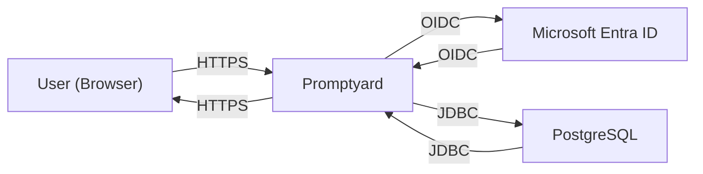

# 3. Context and Scope

| Communication Partner  | Data Exchanged                                                                                                              |
| ---------------------- | --------------------------------------------------------------------------------------------------------------------------- |
| User (Browser)         | HTTP requests/responses: prompt CRUD, profile management, content browsing.                                                 |
| Microsoft Entra ID     | OIDC tokens: authentication flow (authorization code grant), token validation, user identity claims (subject, name, email). |
| PostgreSQL             | SQL: user profiles, content items (prompts), tags. Schema managed by Flyway migrations.                                     |
