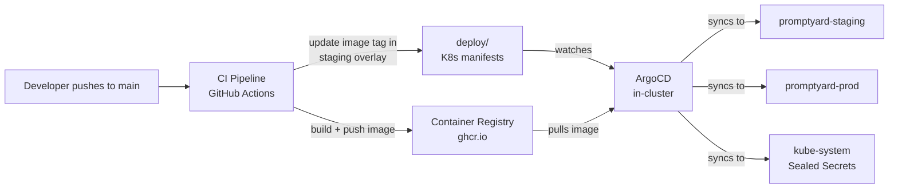
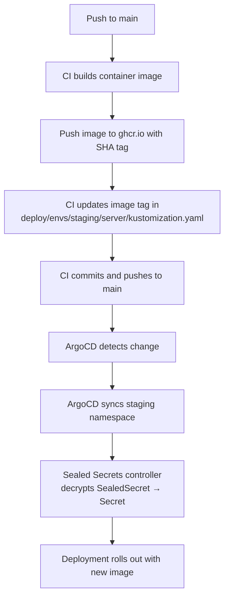
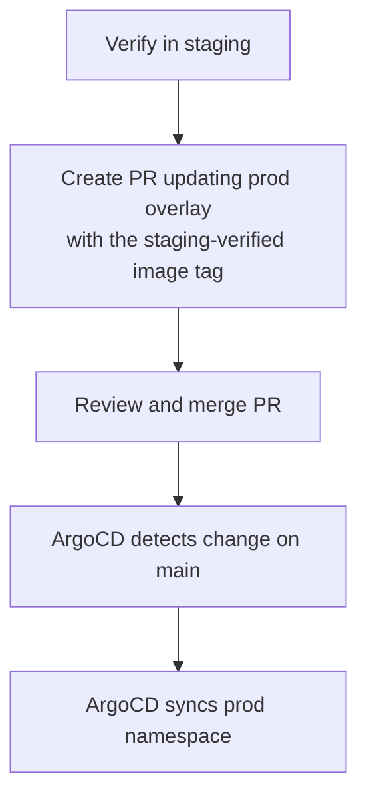

# 7. Deployment View

## Infrastructure Overview

Promptyard runs on a single Kubernetes cluster with two namespaces for staged delivery:

| Environment | Namespace | Deploy Trigger | Sync Mode |
|-------------|-----------|----------------|-----------|
| Local | — | `./mvnw -pl apps/server quarkus:dev` | N/A |
| Staging | `promptyard-staging` | Push to `main` (automatic) | ArgoCD automated sync |
| Production | `promptyard-prod` | PR updating prod overlay (manual) | ArgoCD automated sync on merge |

Local development uses Quarkus dev mode with Dev Services — no Kubernetes required.

## Deployment Pipeline



### Component Responsibilities

| Component | Tool | Purpose |
|-----------|------|---------|
| CI Pipeline | GitHub Actions | Build, test, push container images |
| Container Registry | GitHub Container Registry (ghcr.io) | Store versioned container images |
| GitOps Controller | ArgoCD | Sync desired state from Git to cluster |
| Manifest Management | Kustomize | Manage per-environment Kubernetes manifests |
| Secret Management | Bitnami Sealed Secrets | Encrypt secrets for safe Git storage |

## Manifest Structure

All Kubernetes and ArgoCD configuration lives in the `deploy/` directory:

```
deploy/
├── infra/
│   └── sealed-secrets.yaml              # ArgoCD Application — Sealed Secrets controller
├── apps/
│   ├── promptyard-server-staging.yaml   # ArgoCD Application — staging
│   └── promptyard-server-prod.yaml      # ArgoCD Application — production
├── base/server/
│   ├── kustomization.yaml               # Base Kustomize manifest
│   ├── deployment.yaml                  # Deployment (1 replica, health probes, resource limits)
│   ├── service.yaml                     # ClusterIP Service (port 80 → 8080)
│   └── ingress.yaml                     # Ingress (nginx, host: promptyard.local)
├── envs/
│   ├── staging/server/
│   │   ├── kustomization.yaml           # Overlay — image tag, ConfigMap, namespace
│   │   └── sealed-secret.yaml           # SealedSecret (encrypted credentials)
│   └── prod/server/
│       ├── kustomization.yaml           # Overlay — image tag, ConfigMap, namespace
│       └── sealed-secret.yaml           # SealedSecret (encrypted credentials)
└── kind-config.yaml                     # Local kind cluster config (dev/testing only)
```

### Base Manifests

The base layer in `deploy/base/server/` defines the common Kubernetes resources shared across all
environments:

- **Deployment** — single replica of `ghcr.io/infosupport/promptyard`, with configuration injected
  via a `ConfigMap` (`promptyard-server-config`) and a `Secret` (`promptyard-server-secret`).
  Includes readiness and liveness probes on the Quarkus health endpoints (`/q/health/ready`,
  `/q/health/live`) and resource limits (256–512 Mi memory, 250–500m CPU).
- **Service** — ClusterIP service exposing port 80, forwarding to the container's `http` port
  (8080).
- **Ingress** — nginx ingress routing traffic for `promptyard.local` to the service.

### Environment Overlays

Each environment overlay in `deploy/envs/<env>/server/` extends the base with:

- **Namespace** — sets all resources to `promptyard-staging` or `promptyard-prod`.
- **Image tag** — overrides the container image tag (updated by CI for staging, manually via PR for
  production).
- **ConfigMap** (`configMapGenerator`) — environment-specific non-secret configuration (OIDC auth
  server URL, client ID, JDBC URL, OpenSearch hosts).
- **SealedSecret** — encrypted secret values for OIDC client secret, database credentials, and
  session encryption key. The Sealed Secrets controller decrypts these into regular `Secret`
  resources at runtime.

### ArgoCD Applications

Three ArgoCD Application resources manage the cluster:

| Application | Source Path | Target Namespace | Purpose |
|-------------|------------|------------------|---------|
| `sealed-secrets` | Helm chart (`bitnami-labs/sealed-secrets` v2.17.1) | `kube-system` | Sealed Secrets controller |
| `promptyard-server-staging` | `deploy/envs/staging/server` | `promptyard-staging` | Staging deployment |
| `promptyard-server-prod` | `deploy/envs/prod/server` | `promptyard-prod` | Production deployment |

All three use automated sync with pruning and self-healing. Namespaces are created automatically
(`CreateNamespace=true`).

## Deployment Flow

### Staging



### Production Promotion



Production deployments are gated by pull request review. To promote a staging-verified image:

```bash
cd deploy/envs/prod/server
kustomize edit set image ghcr.io/infosupport/promptyard:<staging-sha>
# Create PR, review, merge — ArgoCD auto-syncs
```

## CI Pipeline

Pull request verification workflows run on every PR that touches the relevant module:

- **`verify-pull-request-server.yml`** — builds and tests the backend (`./mvnw -pl apps/server
  verify`) and the frontend (lint + unit tests with pnpm).
- **`verify-pull-request-client.yml`** — builds and tests the client library
  (`./mvnw -pl apps/client verify`).

> **Note:** The CI workflow for building container images, pushing to ghcr.io, and updating the
> staging image tag on merge to `main` is not yet implemented. Currently only PR verification is
> in place.

## Bootstrap Order

When setting up the cluster from scratch:

1. **Install ArgoCD** — the only manual step:
   ```bash
   kubectl create namespace argocd
   kubectl apply -n argocd \
     -f https://raw.githubusercontent.com/argoproj/argo-cd/stable/manifests/install.yaml
   ```

2. **Deploy Sealed Secrets** — apply the infrastructure app and wait for the controller:
   ```bash
   kubectl apply -f deploy/infra/sealed-secrets.yaml
   kubectl rollout status deployment/sealed-secrets-controller -n kube-system
   ```

3. **Back up the encryption key** — do this immediately; losing the key makes existing sealed
   secrets undecryptable:
   ```bash
   kubectl get secret -n kube-system \
     -l sealedsecrets.bitnami.com/sealed-secrets-key \
     -o yaml > sealed-secrets-key-backup.yaml
   ```

4. **Seal secrets** — encrypt real values per environment with `kubeseal` (see
   [Secret Management](08-crosscutting-concepts.md#secret-management) in Crosscutting Concepts).

5. **Deploy applications** — apply the ArgoCD Application manifests:
   ```bash
   kubectl apply -f deploy/apps/
   ```
