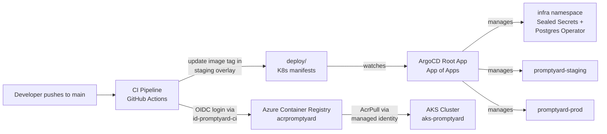
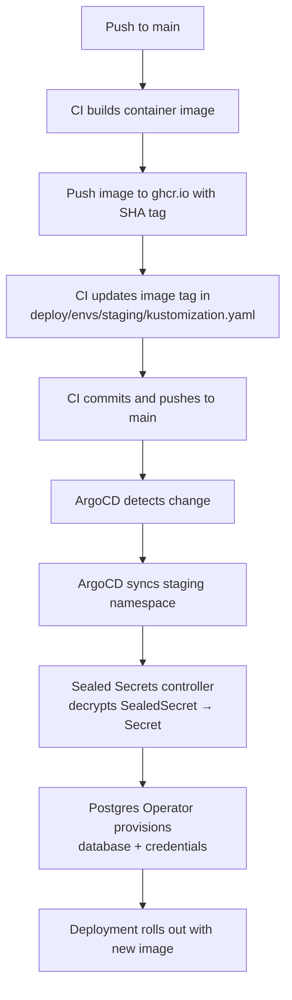
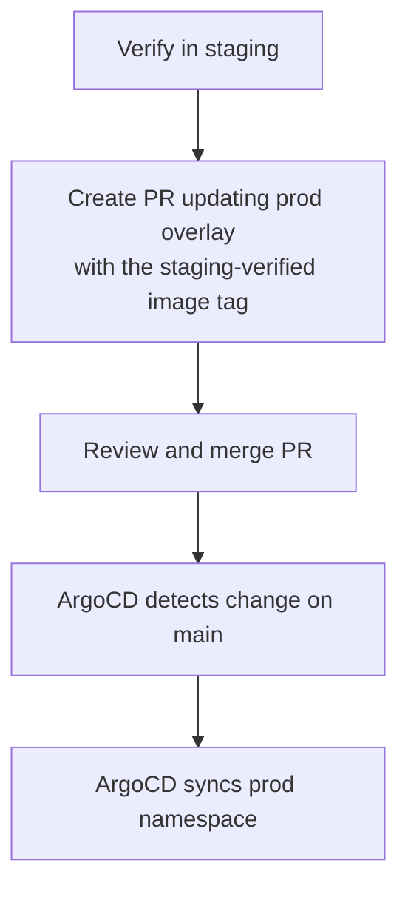

# 7. Deployment View

## Infrastructure Overview

Promptyard runs on an AKS cluster in Azure (West Europe) with two namespaces for staged delivery.
The cluster and supporting Azure resources are provisioned via Bicep templates and deployed manually
with the Azure CLI. This is a temporary setup — the plan is to migrate to an internal Kubernetes
cluster in the near future.

| Environment | Namespace | Deploy Trigger | Sync Mode |
|-------------|-----------|----------------|-----------|
| Local | — | `./mvnw -pl apps/server quarkus:dev` | N/A |
| Staging | `promptyard-staging` | Push to `main` (automatic) | ArgoCD automated sync |
| Production | `promptyard-prod` | PR updating prod overlay (manual) | ArgoCD automated sync on merge |

Local development uses Quarkus dev mode with Dev Services — no Kubernetes required.

Both the root App-of-Apps and the staging application track the `main` branch. The production
application also tracks `main` but uses `prune: false` to prevent accidental resource deletion.

## Azure Infrastructure

The Azure infrastructure is defined as Bicep templates in `deploy/azure/` and deployed manually via
the Azure CLI. All resources live in a single resource group (`rg-promptyard`) in West Europe.

### Resources

| Resource | Name | Purpose |
|----------|------|---------|
| Resource Group | `rg-promptyard` | Contains all Azure resources |
| AKS Cluster | `aks-promptyard` | Kubernetes cluster (3× Standard_D2as_v5 nodes) |
| Container Registry | `acrpromptyard` | Stores container images (Basic tier) |
| Managed Identity | `id-promptyard-ci` | CI identity for pushing images to ACR |

The AKS cluster uses a system-assigned managed identity with an AcrPull role assignment so nodes can
pull images from ACR without credentials. OIDC issuer and workload identity are enabled for future
service integrations.

The CI managed identity (`id-promptyard-ci`) has an AcrPush role on the registry and a federated
credential for GitHub Actions OIDC, allowing the CI pipeline to authenticate and push images without
storing secrets.

### Bicep Structure

```
deploy/azure/
├── main.bicep            # Subscription-scoped entry point (creates RG, deploys modules)
├── main.bicepparam       # Parameter values
└── modules/
    ├── acr.bicep         # Azure Container Registry
    ├── aks.bicep         # AKS cluster + AcrPull role assignment
    └── identity.bicep    # CI managed identity + AcrPush role + GitHub OIDC federation
```

### Deploying

Preview changes before applying:

```bash
az deployment sub what-if \
  --location westeurope \
  --template-file deploy/azure/main.bicep \
  --parameters deploy/azure/main.bicepparam
```

Deploy:

```bash
az deployment sub create \
  --location westeurope \
  --template-file deploy/azure/main.bicep \
  --parameters deploy/azure/main.bicepparam
```

Retrieve the kubeconfig after deployment:

```bash
az aks get-credentials --resource-group rg-promptyard --name aks-promptyard
```

## Deployment Pipeline



### Component Responsibilities

| Component | Tool | Purpose |
|-----------|------|---------|
| Infrastructure | Azure Bicep | Provision AKS, ACR, and managed identities |
| CI Pipeline | GitHub Actions | Build, test, push container images |
| Container Registry | Azure Container Registry | Store versioned container images |
| GitOps Controller | ArgoCD | Sync desired state from Git to cluster |
| Manifest Management | Kustomize | Manage per-environment Kubernetes manifests |
| Secret Management | Bitnami Sealed Secrets | Encrypt secrets for safe Git storage |
| Database Management | Zalando Postgres Operator | Manage PostgreSQL instances via CRDs |

## Manifest Structure

All Kubernetes and ArgoCD configuration lives in the `deploy/` directory:

```
deploy/
├── root-app.yaml                        # Root ArgoCD Application (App of Apps)
├── kind-config.yaml                     # Local KinD cluster config
├── apps/                                # Child ArgoCD Applications
│   ├── postgres-operator.yaml
│   ├── sealed-secrets.yaml
│   ├── staging.yaml
│   └── prod.yaml
├── base/server/                         # Base Kustomize manifests
│   ├── kustomization.yaml
│   ├── deployment.yaml
│   ├── service.yaml
│   ├── ingress.yaml
│   └── database.yaml
└── envs/
    ├── base/                            # Shared base referenced by overlays
    │   ├── kustomization.yaml
    │   └── server/
    │       ├── kustomization.yaml
    │       ├── database.yaml
    │       ├── deployment.yaml
    │       ├── service.yaml
    │       └── ingress.yaml
    ├── staging/
    │   ├── kustomization.yaml
    │   ├── namespace.yaml
    │   ├── configmap.yaml
    │   ├── sealed-secret.yaml
    │   ├── ghcr-pull-secret.yaml
    │   └── patches/
    │       ├── deployment-patch.yaml
    │       ├── ingress-patch.yaml
    │       └── database-patch.yaml
    └── prod/
        ├── kustomization.yaml
        ├── namespace.yaml
        ├── configmap.yaml
        ├── sealed-secret.yaml
        ├── ghcr-pull-secret.yaml
        └── patches/
            ├── deployment-patch.yaml
            ├── ingress-patch.yaml
            └── database-patch.yaml
```

### Base Manifests

The base layer in `deploy/base/server/` defines the common Kubernetes resources shared across all
environments:

- **Deployment** — single replica of `ghcr.io/infosupport/promptyard`, with configuration injected
  via a `ConfigMap` (`promptyard-server-config`) and a `Secret` (`promptyard-server-secret`).
  Database credentials are sourced from a Postgres Operator-managed secret
  (`promptyard-server.promptyard-db.credentials.postgresql.acid.zalan.do`). Uses an image pull
  secret (`ghcr-pull-secret`) for pulling from ghcr.io. Includes readiness and liveness probes on
  the Quarkus health endpoints (`/q/health/ready`, `/q/health/live`) and resource limits
  (256–512 Mi memory, 250–500m CPU).
- **Service** — ClusterIP service exposing port 80, forwarding to the container's `http` port
  (8080).
- **Ingress** — nginx ingress routing traffic for `promptyard.local` to the service.
- **Database** — Zalando PostgreSQL CRD (`acid.zalan.do/v1`) defining a `promptyard-db` cluster:
  PostgreSQL 17, team `promptyard`, user `promptyard_server` with a 1 Gi volume and single instance
  (overridden per environment via patches).

### Environment Overlays

Each environment overlay in `deploy/envs/<env>/` extends the shared base at `deploy/envs/base/`
with environment-specific resources and patches:

- **Namespace** — creates and targets `promptyard-staging` or `promptyard-prod`.
- **ConfigMap** (`promptyard-server-config`) — environment-specific non-secret configuration (OIDC
  auth server URL, client ID, JDBC URL, OpenSearch hosts).
- **SealedSecret** (`promptyard-server-secret`) — encrypted secret values for OIDC client secret
  and session encryption key. The Sealed Secrets controller decrypts these into regular `Secret`
  resources at runtime.
- **SealedSecret** (`ghcr-pull-secret`) — encrypted Docker registry credentials for pulling images
  from ghcr.io.
- **Image tag** — overrides the container image tag (updated by CI for staging, manually via PR for
  production).
- **Patches** — strategic merge patches that modify deployment (replicas, resources), ingress
  (hostname), and database (instances, volume size) per environment.

Key differences between environments:

| Setting | Staging | Production |
|---------|---------|------------|
| Replicas | 1 | 3 |
| CPU requests | 100m | 250m |
| CPU limits | 500m | 1 |
| Memory requests | 128 Mi | 256 Mi |
| Memory limits | 512 Mi | 1 Gi |
| DB instances | 1 | 3 |
| DB volume size | 5 Gi | 15 Gi |
| ArgoCD prune | enabled | disabled (safety) |

### ArgoCD Applications

Five ArgoCD Application resources manage the cluster via an App-of-Apps pattern:

| Application | Type | Source | Target Namespace | Purpose |
|---|---|---|---|---|
| `promptyard` (root) | Kustomize directory | `deploy/apps` | — | App of Apps, manages all child apps |
| `postgres-operator` | Helm chart (`1.*`) | Zalando chart repo | `infra` | PostgreSQL Operator |
| `sealed-secrets` | Helm chart (`2.*`) | Bitnami chart repo | `infra` | Sealed Secrets controller |
| `promptyard-staging` | Kustomize directory | `deploy/envs/staging` | `promptyard-staging` | Staging deployment |
| `promptyard-prod` | Kustomize directory | `deploy/envs/prod` | `promptyard-prod` | Production deployment |

All applications use automated sync with self-healing. The production application has `prune: false`
to prevent accidental resource deletion. Namespaces are created automatically
(`CreateNamespace=true`).

## Deployment Flow

### Staging



### Production Promotion



Production deployments are gated by pull request review. To promote a staging-verified image:

```bash
cd deploy/envs/prod
kustomize edit set image ghcr.io/infosupport/promptyard:<staging-sha>
# Create PR, review, merge — ArgoCD auto-syncs
```

## CI Pipeline

Pull request verification workflows run on every PR that touches the relevant module:

- **`verify-pull-request-server.yml`** — builds and tests the backend (`./mvnw -pl apps/server
  verify`) and the frontend (lint + unit tests with pnpm).
- **`verify-pull-request-client.yml`** — builds and tests the client library
  (`./mvnw -pl apps/client verify`).

> **Note:** The CI workflow for building container images, pushing to ghcr.io, and updating the
> staging image tag on merge to `main` is not yet implemented. Currently only PR verification is
> in place.

## Bootstrap Order

When setting up the cluster from scratch:

1. **Provision Azure infrastructure** — deploy the AKS cluster, ACR, and CI identity:
   ```bash
   az deployment sub create \
     --location westeurope \
     --template-file deploy/azure/main.bicep \
     --parameters deploy/azure/main.bicepparam
   az aks get-credentials --resource-group rg-promptyard --name aks-promptyard
   ```

2. **Install ArgoCD**:
   ```bash
   kubectl create namespace argocd
   kubectl apply -n argocd \
     -f https://raw.githubusercontent.com/argoproj/argo-cd/stable/manifests/install.yaml
   ```

3. **Apply the root app** — this bootstraps everything else (Sealed Secrets, Postgres Operator, and
   all environment deployments):
   ```bash
   kubectl apply -f deploy/root-app.yaml
   ```

4. **Back up the Sealed Secrets encryption key** — do this once the controller is running; losing
   the key makes existing sealed secrets undecryptable:
   ```bash
   kubectl get secret -n infra \
     -l sealedsecrets.bitnami.com/sealed-secrets-key \
     -o yaml > sealed-secrets-key-backup.yaml
   ```

5. **Seal secrets** — encrypt real values per environment with `kubeseal` (see
   [Secret Management](08-crosscutting-concepts.md#secret-management) in Crosscutting Concepts).
