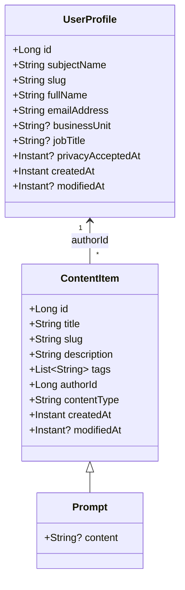

# 8. Crosscutting Concepts

## Domain Model



- **Single-table inheritance:** `ContentItem` is the base entity with a `content_type` discriminator column. `Prompt` extends it with a `content` field. New content types can be added as subclasses without schema changes.
- **Tags:** Stored in a separate `content_item_tags` join table via `@ElementCollection` with eager fetch. Cascade delete is handled at the database level.
- **Author relationship:** `ContentItem.author` is a lazy-loaded `@ManyToOne` to `UserProfile`.

## Authentication and Authorization

### Authentication

- **Protocol:** OpenID Connect (authorization code flow) via Quarkus OIDC in `web-app` mode.
- **Provider:** EntraID, configured in `application.properties` with realm, client ID, and client secret.
- **Identity propagation:** `SecurityIdentity` is injected into resources to access the authenticated user's subject name, full name, and email address from token claims.
- **Endpoint protection:** All REST endpoints are annotated with `@Authenticated`. Unauthenticated requests receive a 302 redirect to the Keycloak login page.

### Authorization

- **Ownership-based:** Authorization is enforced in resource methods by comparing the authenticated user's profile ID with the content item's `authorId`.
- **Example:** Prompt deletion checks that the current user is the author; returns 403 Forbidden otherwise.
- **No role-based access control** is currently implemented; all authenticated users have the same capabilities.

## Persistence

### ORM

- **Hibernate ORM Panache (Kotlin):** Repositories extend `PanacheRepository<T>`, providing standard CRUD operations plus custom queries.
- **Entity pattern:** Entities use JPA annotations with field access. No active record pattern — dedicated repository classes handle all data access.

### Schema Migrations

- **Flyway:** Migrations reside in `src/main/resources/db/migration/` using the naming convention `V{n}__Description.sql`.
- **Auto-migration:** `quarkus.flyway.migrate-at-start=true` ensures the schema is current on every application start.
- **Current migrations:**
  - `V1__CreateUserProfile.sql` — `user_profile` table
  - `V2__CreateContentItem.sql` — `content_item` table (with discriminator), `content_item_tags` join table, foreign keys

### Slug Generation

URL-friendly slugs serve as public identifiers instead of numeric IDs:

1. Convert input (name or title) to lowercase
2. Trim whitespace
3. Remove non-alphanumeric characters (except hyphens and spaces)
4. Replace spaces with hyphens, collapse consecutive hyphens
5. Check uniqueness (scoped by content type for content items)
6. If duplicate, append incrementing counter (`-2`, `-3`, ...) until unique

## Local Kubernetes Development

Use this setup only for testing the deployment manifests. You can run the application 
without running on Kubernetes with `./mvnw -pl apps/serverquarkus:dev`. We recommend 
that approach over the steps documented here.

### Prerequisites

- [kind](https://kind.sigs.k8s.io/) — Kubernetes in Docker
- [kubectl](https://kubernetes.io/docs/tasks/tools/) — Kubernetes CLI

### Create the cluster

```bash
kind create cluster --config deploy/kind-config.yaml
```

This creates a single-node cluster with port mappings for the nginx ingress controller (host ports 80 and 443).

### Install the nginx ingress controller

```bash
kubectl apply -f https://raw.githubusercontent.com/kubernetes/ingress-nginx/main/deploy/static/provider/kind/deploy.yaml
```

Wait for the controller to be ready:

```bash
kubectl wait --namespace ingress-nginx \
  --for=condition=ready pod \
  --selector=app.kubernetes.io/component=controller \
  --timeout=90s
```

### Add a hosts entry

Add the following line to `/etc/hosts` so that `promptyard.local` resolves to your local cluster:

```
127.0.0.1 promptyard.local
```

### Deploy the application

```bash
kubectl kustomize deploy/base/server/ | kubectl apply -f -
```

### Access the application

Open [http://promptyard.local](http://promptyard.local) in your browser.

## User Interface

## Error Handling

## Logging and Monitoring


## Testing

## Serialization
