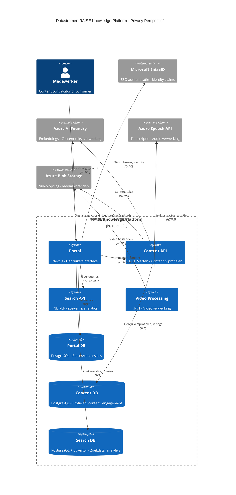

# Data Protection Impact Assessment (DPIA)

# RAISE Knowledge Platform

**Versie:** 1.0
**Datum:** 29 januari 2026
**Status:** Concept ter beoordeling
**Eigenaar:** Platform Team

---

## 1. Inleiding

### 1.1 Doel van dit document

Deze Data Protection Impact Assessment (DPIA) beoordeelt de privacyrisico's van het RAISE Knowledge Platform, een intern kennisdelingsplatform voor Info Support medewerkers. Het platform stelt teams in staat om AI-technieken te vinden en toe te passen in hun software development workflow.

### 1.2 Waarom een DPIA?

Een DPIA is verplicht wanneer gegevensverwerking waarschijnlijk een hoog risico inhoudt voor de rechten en vrijheden van betrokkenen (artikel 35 AVG). Dit platform verwerkt:

- Persoonsgegevens van medewerkers (profielen, vaardigheden, leerdoelen)
- Gedragsgegevens (zoekgedrag, content interacties)
- Professionele ambities en carrière-informatie

### 1.3 Scope

Deze DPIA omvat:

- Het RAISE Knowledge Platform (Portal, Content API, Search API, Video Processing API)
- Integraties met externe systemen (EntraID, Azure AI Foundry, Azure Speech, Azure Blob Storage)
- Alle persoonsgegevens die worden verzameld, verwerkt en opgeslagen

---

## 2. Beschrijving van de verwerking

### 2.1 Aard van de verwerking

Het RAISE Knowledge Platform is een intern kennisdelingsplatform dat:

1. Medewerkers in staat stelt prompts, Claude Code skills, MCP-configuraties en video's te delen
2. Zoek- en ontdekkingsfunctionaliteit biedt voor AI-content
3. Gebruikersprofielen beheert met AI-vaardigheden en leerdoelen
4. Ratings, feedback en engagement bijhoudt
5. Analytics genereert over platformgebruik

### 2.2 Verwerkingsverantwoordelijke

Info Support B.V. is verwerkingsverantwoordelijke voor alle persoonsgegevens die via het platform worden verwerkt.

### 2.3 Categorieën betrokkenen

| Categorie               | Beschrijving                                        | Geschat aantal |
| ----------------------- | --------------------------------------------------- | -------------- |
| Content Contributors    | Meesters en ervaren practitioners die content delen | 50-100         |
| Content Consumers       | Medewerkers die content zoeken en gebruiken         | 500-1000       |
| AI Champions            | Curators die content kwaliteit waarborgen           | 10-20          |
| Platform Administrators | Beheerders van het platform                         | 2-5            |

### 2.4 Categorieën persoonsgegevens

#### 2.4.1 Identificatiegegevens (Content API - UserProfile)

| Gegeven        | Bron                | Bewaartermijn         | Rechtsgrond             |
| -------------- | ------------------- | --------------------- | ----------------------- |
| UserId (GUID)  | Systeem gegenereerd | Zolang account actief | Uitvoering overeenkomst |
| SubjectName    | EntraID             | Zolang account actief | Uitvoering overeenkomst |
| E-mailadres    | EntraID             | Zolang account actief | Uitvoering overeenkomst |
| Volledige naam | EntraID             | Zolang account actief | Uitvoering overeenkomst |
| Functietitel   | Gebruikersinvoer    | Zolang account actief | Toestemming             |
| Business Unit  | Gebruikersinvoer    | Zolang account actief | Toestemming             |

#### 2.4.2 AI Skills Profile (Content API)

| Gegeven              | Doel                           | Bewaartermijn         | Rechtsgrond |
| -------------------- | ------------------------------ | --------------------- | ----------- |
| AI Tools ervaring    | Personalisatie, peer discovery | Zolang account actief | Toestemming |
| AI Tools ambities    | Content aanbevelingen          | Zolang account actief | Toestemming |
| Voltooide trainingen | Profiel weergave               | Zolang account actief | Toestemming |
| Gewenste trainingen  | Content aanbevelingen          | Zolang account actief | Toestemming |
| Client initiatieven  | Peer discovery                 | Zolang account actief | Toestemming |
| Praktische ervaring  | Contributor identificatie      | Zolang account actief | Toestemming |
| Persoonlijk AI-doel  | Motivatie tracking             | Per kalenderjaar      | Toestemming |
| Visibility settings  | Privacy controle               | Zolang account actief | Toestemming |

#### 2.4.3 Sessie- en authenticatiegegevens (Portal - BetterAuth)

| Gegeven             | Doel           | Bewaartermijn         | Rechtsgrond             |
| ------------------- | -------------- | --------------------- | ----------------------- |
| Session tokens      | Authenticatie  | Tot logout/expiry     | Uitvoering overeenkomst |
| OAuth account links | SSO integratie | Zolang account actief | Uitvoering overeenkomst |
| Laatste login       | Security       | 1 jaar                | Gerechtvaardigd belang  |

#### 2.4.4 Content en engagement (Content API)

| Gegeven           | Doel              | Bewaartermijn          | Rechtsgrond             |
| ----------------- | ----------------- | ---------------------- | ----------------------- |
| Ratings           | Kwaliteitssignaal | Zolang content bestaat | Gerechtvaardigd belang  |
| Comments          | Feedback          | Zolang content bestaat | Gerechtvaardigd belang  |
| Success stories   | Sociale proof     | Zolang content bestaat | Toestemming             |
| Bookmarks         | Gebruiksgemak     | Zolang account actief  | Uitvoering overeenkomst |
| Content bijdragen | Auteurschap       | Zolang content bestaat | Uitvoering overeenkomst |
| Content views     | Analytics         | Geaggregeerd na 1 jaar | Gerechtvaardigd belang  |

#### 2.4.5 Zoek- en gedragsgegevens (Search API)

| Gegeven            | Doel                       | Bewaartermijn | Rechtsgrond            |
| ------------------ | -------------------------- | ------------- | ---------------------- |
| Zoekqueries        | Gap analyse, verbeteringen | 6 maanden     | Gerechtvaardigd belang |
| Failed searches    | Content gaps identificeren | 6 maanden     | Gerechtvaardigd belang |
| Click-through data | Zoekeffectiviteit          | 6 maanden     | Gerechtvaardigd belang |

#### 2.4.6 Video metadata (Video Processing API)

| Gegeven         | Doel             | Bewaartermijn        | Rechtsgrond             |
| --------------- | ---------------- | -------------------- | ----------------------- |
| Uploader userId | Auteurschap      | Zolang video bestaat | Uitvoering overeenkomst |
| Video titel     | Zoeken/weergave  | Zolang video bestaat | Uitvoering overeenkomst |
| Transcriptie    | Doorzoekbaarheid | Zolang video bestaat | Uitvoering overeenkomst |

---

## 3. Datastromen en externe verwerkers

### 3.1 Architectuuroverzicht

**Datastromen met persoonsgegevens:**

| Van                             | Naar                                      | Persoonsgegevens |
| ------------------------------- | ----------------------------------------- | ---------------- |
| Medewerker → Portal             | Profielgegevens, zoekqueries, ratings     |
| Portal → EntraID                | Identity claims (naam, email, subject)    |
| Portal → Content API            | Profielupdates, content met auteur        |
| Portal → Search API             | Zoektermen (mogelijk herleidbaar)         |
| Content API → AI Foundry        | Content tekst (bevat mogelijk auteurnaam) |
| Video Processing → Speech API   | Audio (kan stemherkenning bevatten)       |
| Video Processing → Blob Storage | Video bestanden (kan personen bevatten)   |

### 3.2 Verwerkers en subverwerkers

| Verwerker            | Dienst                                        | Locatie          | Verwerkersovereenkomst |
| -------------------- | --------------------------------------------- | ---------------- | ---------------------- |
| Microsoft Azure      | EntraID, AI Foundry, Speech API, Blob Storage | EU (West Europe) | Microsoft DPA          |
| Info Support Hosting | PostgreSQL databases, RabbitMQ                | Nederland        | Intern                 |

### 3.3 Internationale doorgifte

Alle gegevens worden verwerkt binnen de EU (Azure West Europe regio). Er vindt geen doorgifte naar derde landen plaats.

---

## 4. Noodzakelijkheid en proportionaliteit

### 4.1 Doelbinding

| Verwerking            | Doel                           | Noodzakelijk?    | Alternatieven overwogen                              |
| --------------------- | ------------------------------ | ---------------- | ---------------------------------------------------- |
| Identificatiegegevens | Authenticatie, auteurschap     | Ja               | Anonieme toegang: afgewezen (geen accountability)    |
| AI Skills Profile     | Personalisatie, peer discovery | Ja, mits opt-in  | Verplichte profielen: afgewezen (privacy-inbreuk)    |
| Zoekgedrag            | Platform verbetering           | Ja, geaggregeerd | Geen tracking: afgewezen (geen gap analyse mogelijk) |
| Video transcripties   | Doorzoekbaarheid               | Ja               | Handmatige tags: te arbeidsintensief                 |
| Ratings/comments      | Kwaliteitssignaal              | Ja               | Expert curation alleen: niet schaalbaar              |

### 4.2 Dataminimalisatie

| Categorie       | Minimalisatiemaatregelen                                       |
| --------------- | -------------------------------------------------------------- |
| Profielgegevens | Alleen functietitel en unit zijn optioneel; geen privégegevens |
| AI Skills       | Volledige controle via visibility settings (publiek/privé)     |
| Zoekgedrag      | Alleen queries opslaan, niet volledige browsing history        |
| Analytics       | Na 1 jaar aggregeren naar niet-herleidbare statistieken        |

### 4.3 Opslagbeperking

| Gegevenscategorie | Bewaartermijn               | Verwijderproces             |
| ----------------- | --------------------------- | --------------------------- |
| Account actief    | Zolang dienstverband        | Automatisch bij offboarding |
| Zoekanalytics     | 6 maanden                   | Geautomatiseerd opschonen   |
| Content views     | 1 jaar, daarna geaggregeerd | Geautomatiseerd             |
| Sessiedata        | Tot logout of 24 uur        | Automatisch                 |

---

## 5. Risico-analyse

### 5.1 Risicomatrix

| #   | Risico                                              | Waarschijnlijkheid | Impact    | Score         | Mitigatie                                             |
| --- | --------------------------------------------------- | ------------------ | --------- | ------------- | ----------------------------------------------------- |
| R1  | Ongeautoriseerde toegang tot profielgegevens        | Laag               | Gemiddeld | **Laag**      | SSO via EntraID, RBAC, audit logging                  |
| R2  | Lekken van AI-ambities naar externen                | Zeer laag          | Laag      | **Zeer laag** | Intern platform, geen externe toegang                 |
| R3  | Profilering van medewerkers op basis van zoekgedrag | Gemiddeld          | Gemiddeld | **Gemiddeld** | Geen individuele tracking, alleen aggregaten          |
| R4  | Datadiefstal via Azure services                     | Laag               | Hoog      | **Gemiddeld** | Microsoft security, managed identities, versleuteling |
| R5  | Video's bevatten gevoelige informatie               | Gemiddeld          | Gemiddeld | **Gemiddeld** | Content richtlijnen, moderatie queue                  |
| R6  | AI Skills profile misbruik voor HR-beslissingen     | Laag               | Hoog      | **Gemiddeld** | Duidelijke doelbinding, toegangscontrole              |
| R7  | Verlies van beschikbaarheid                         | Laag               | Laag      | **Laag**      | Azure redundantie, backups                            |

### 5.2 Gedetailleerde risicobeoordeling

#### R3: Profilering op basis van zoekgedrag

**Beschrijving:** Zoekqueries kunnen patronen onthullen over wat medewerkers niet weten, wat kan worden gebruikt voor onbedoelde doeleinden.

**Huidige situatie:**

- Search API slaat queries op met timestamp
- author_id is aanwezig in search vectors

**Maatregelen:**

- [ ] Zoekqueries opslaan zonder directe koppeling aan userId
- [ ] Na 6 maanden automatisch verwijderen
- [ ] Geen individuele zoekhistorie beschikbaar maken aan managers
- [ ] Analytics alleen geaggregeerd presenteren

#### R5: Gevoelige informatie in video's

**Beschrijving:** Gebruikers kunnen per ongeluk client-informatie, credentials of andere gevoelige data in video's delen.

**Huidige situatie:**

- Video upload zonder voorafgaande screening
- Transcripties worden geïndexeerd en doorzoekbaar

**Maatregelen:**

- [ ] Duidelijke upload richtlijnen tonen
- [ ] Moderatie queue voor nieuwe video's
- [ ] Optie voor uploader om video terug te trekken
- [ ] Geen automatische publicatie

#### R6: Misbruik AI Skills Profile

**Beschrijving:** Profielgegevens over vaardigheden en ambities kunnen worden misbruikt voor beoordelingen of HR-beslissingen.

**Huidige situatie:**

- Profile visibility settings beschikbaar
- Geen integratie met HR-systemen gepland

**Maatregelen:**

- [ ] Expliciete doelbinding documenteren: alleen voor kennisdeling
- [ ] Toegang tot profielen beperken tot platformgebruikers
- [ ] Geen export van profielgegevens naar HR-systemen
- [ ] Privacy policy duidelijk communiceren

---

## 6. Rechten van betrokkenen

### 6.1 Implementatie van rechten

| Recht                           | Implementatie                                                                  | Termijn  |
| ------------------------------- | ------------------------------------------------------------------------------ | -------- |
| **Inzage** (art. 15)            | Profielpagina toont alle persoonlijke gegevens; export functie                 | Direct   |
| **Rectificatie** (art. 16)      | Profiel bewerken via portal                                                    | Direct   |
| **Verwijdering** (art. 17)      | Account verwijderen verwijdert persoonsgegevens; content blijft geanonimiseerd | 30 dagen |
| **Beperking** (art. 18)         | Profiel op "privé" zetten                                                      | Direct   |
| **Overdraagbaarheid** (art. 20) | Export van profiel en bijdragen in JSON formaat                                | 30 dagen |
| **Bezwaar** (art. 21)           | Uitschrijven van aanbevelingen en analytics                                    | Direct   |

### 6.2 Procedures

1. **Verzoeken indienen:** Via privacy@infosupport.com of via platform settings
2. **Verificatie:** Identiteit wordt geverifieerd via EntraID sessie
3. **Afhandeling:** Binnen 30 dagen, tenzij complexiteit verlenging rechtvaardigt
4. **Logging:** Alle verzoeken worden gelogd voor accountability

---

## 7. Technische en organisatorische maatregelen

### 7.1 Technische maatregelen

| Maatregel                     | Status              | Details                                 |
| ----------------------------- | ------------------- | --------------------------------------- |
| **Authenticatie**             | ✅ Geïmplementeerd  | OIDC via EntraID/Keycloak               |
| **Autorisatie**               | ✅ Geïmplementeerd  | RBAC (contributor, champion, admin)     |
| **Versleuteling in transit**  | ✅ Geïmplementeerd  | HTTPS/TLS voor alle communicatie        |
| **Versleuteling at rest**     | ✅ Geïmplementeerd  | Azure managed encryption                |
| **Database isolatie**         | ✅ Geïmplementeerd  | Gescheiden databases per service        |
| **Input validatie**           | ✅ Geïmplementeerd  | Parameterized queries, Zod validatie    |
| **Audit logging**             | ⏳ Gepland          | Security events loggen                  |
| **Pseudonimisering zoekdata** | ⏳ Te implementeren | UserId niet direct koppelen aan queries |

### 7.2 Organisatorische maatregelen

| Maatregel                  | Status             | Details                              |
| -------------------------- | ------------------ | ------------------------------------ |
| **Privacy policy**         | ⏳ Te schrijven    | Moet beschikbaar zijn voor lancering |
| **Content richtlijnen**    | ⏳ Te schrijven    | Geen gevoelige data in content       |
| **Data retention policy**  | ⏳ Te formaliseren | Zie sectie 4.3                       |
| **Incident response plan** | ⏳ Aan te sluiten  | Op Info Support standaard            |
| **Training beheerders**    | ⏳ Te plannen      | Privacy awareness                    |

---

## 8. Consultatie

### 8.1 Betrokkenen geconsulteerd

| Partij                       | Datum           | Input                          |
| ---------------------------- | --------------- | ------------------------------ |
| Privacy Officer Info Support | [In te plannen] | Review DPIA                    |
| Ondernemingsraad             | [In te plannen] | Advies over medewerkersdata    |
| Potentiële gebruikers        | [User research] | Acceptatie visibility settings |

### 8.2 Functionaris Gegevensbescherming (FG)

Advies van de FG is vereist voordat het platform in productie gaat. De FG wordt gevraagd om:

1. Deze DPIA te reviewen
2. Aanvullende maatregelen te adviseren indien nodig
3. Goedkeuring te geven voor go-live

---

## 9. Conclusie en aanbevelingen

### 9.1 Algehele risicobeoordeling

Na implementatie van de voorgestelde maatregelen is het resterende privacyrisico **ACCEPTABEL**.

De verwerking is noodzakelijk voor het bereiken van legitieme organisatiedoelen (kennisdeling, AI-adoptie) en de risico's worden adequaat gemitigeerd door technische en organisatorische maatregelen.

### 9.2 Voorwaarden voor go-live

Voordat het platform in productie kan:

**Must have (blokkerend):**

1. [ ] Privacy policy beschikbaar en geaccepteerd door gebruikers
2. [ ] Visibility settings voor AI Skills Profile volledig werkend
3. [ ] FG goedkeuring ontvangen
4. [ ] Content richtlijnen gepubliceerd

**Should have (eerste release):** 

5. [ ] Pseudonimisering van zoekqueries 
6. [ ] Audit logging operationeel 
7. [ ] Data retention automatisering

**Could have (na lancering):** 

8. [ ] Data export functionaliteit (portability) 
9. [ ] Geavanceerde analytics met aggregatie

### 9.3 Monitoring en herziening

Deze DPIA wordt herzien:

- Jaarlijks, of
- Bij significante wijzigingen aan het platform, of
- Bij wijzigingen in wet- of regelgeving

---

## 10. Goedkeuring

| Rol             | Naam | Datum | Handtekening |
| --------------- | ---- | ----- | ------------ |
| Product Owner   |      |       |              |
| Privacy Officer |      |       |              |
| FG              |      |       |              |
| Technisch Lead  |      |       |              |

---

## Bijlage A: Wettelijk kader

- **AVG/GDPR** (Verordening (EU) 2016/679)
- **UAVG** (Uitvoeringswet AVG)
- **Artikel 35 AVG**: Gegevensbeschermingseffectbeoordeling

## Bijlage B: Referenties

- `docs/architecture/` - Technische architectuur documentatie
- `docs/architecture/08-concepts.md` - Database schema's en security boundaries
- `docs/product/platform-impactmapping.md` - Functionele requirements
- `docs/design/profile-page-spec.md` - AI Skills Profile specificatie

## Bijlage C: Versiegeschiedenis

| Versie | Datum      | Auteur        | Wijzigingen   |
| ------ | ---------- | ------------- | ------------- |
| 1.0    | 2026-01-29 | Platform Team | Initiële DPIA |
