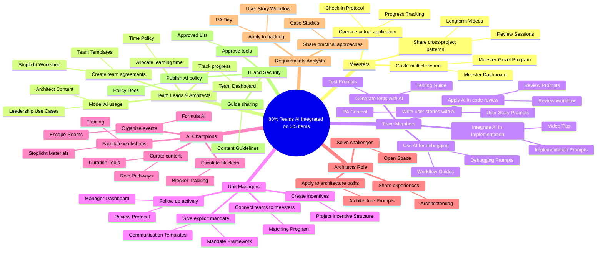

# Impact Map: RAISE Program 2026 - AISE Team Adoption

## Goal

**80% of Info Support teams has AI integrated into their workflow on at least 3 of the top 5 items by end of 2026.**

### The Top 5 Workflow Items

1. User story implementation in code
2. Debugging and bug fixing
3. Code reviews
4. Writing tests
5. Writing user stories

### Goal Breakdown

| Component      | Description                                                                    |
| -------------- | ------------------------------------------------------------------------------ |
| **Specific**   | Teams integrate AI into their daily workflow across multiple core activities   |
| **Measurable** | 80% of teams using AI on 3+ of the 5 workflow items                            |
| **Achievable** | Building on 2025 individual adoption, now shifting to team-level integration   |
| **Relevant**   | Strengthens Info Support's position with clients; improves delivery capability |
| **Time-bound** | End of 2026                                                                    |

### Success Metrics

- Primary: Percentage of teams with AI integrated on 3+ workflow items
- Secondary: Number of teams completing Stoplicht workshop
- Secondary: Number of active meester-gezel relationships
- Secondary: Management engagement (active follow-up on AI adoption)
- Secondary: Content engagement on knowledge platform

### Capability Dimensions

The program builds capabilities along two dimensions:

1. **Knowledge** - Understanding how AI tools work and what is possible
2. **Executability** - Actually applying AI in real project work

Both dimensions must be addressed to achieve team adoption.

---

## Actors and Impacts

### Meesters (Experienced AI Practitioners)

**Context:** Colleagues like Michael, Sander, and others who have successfully applied AI in their projects. Instead of doing all AI projects themselves, they guide others in the meester-gezel approach. Critical for scaling executability across the organization.

| Impact                                                                   | Deliverables                                                        |
| ------------------------------------------------------------------------ | ------------------------------------------------------------------- |
| Guide multiple teams in applying AI rather than doing it all themselves  | Meester-Gezel Matching Program, Meester Dashboard                   |
| Share cross-project learnings and patterns to build shared understanding | Knowledge Platform (Longform Videos), Cross-Project Review Sessions |
| Provide oversight on actual AI application in projects                   | Project Progress Tracking, Meester Check-in Protocol                |
| Connect teams facing similar challenges                                  | Community Events, Cross-Project Knowledge Sharing                   |

**Key Question:** How do we free up meester capacity while maintaining their own project work?

---

### Team Leads and Architects

**Context:** Technical leaders who set the tone for their teams. When they normalize AI usage, team members follow. They translate management mandate into daily practice and create space for experimentation.

| Impact                                                        | Deliverables                                            |
| ------------------------------------------------------------- | ------------------------------------------------------- |
| Model AI usage in their own work to set team expectations     | Leadership Use Case Library, Architect-Specific Content |
| Create explicit team agreements on AI integration in workflow | Stoplicht Workshop, Team AI Agreements Template         |
| Allocate time for team members to learn and experiment        | Learning Time Policy, Team Learning Budgets             |
| Track and report team progress on AI adoption                 | Team Dashboard, Adoption Metrics by Workflow Item       |

**Key Question:** How do we equip them to lead by example when they may still be learning themselves?

---

### Development Team Members

**Context:** The core audience for team adoption. They need both knowledge (how to use AI effectively) and executability support (permission, time, guidance) to integrate AI into their daily workflow on the top 5 items.

| Impact                                               | Deliverables                                                         |
| ---------------------------------------------------- | -------------------------------------------------------------------- |
| Integrate AI into user story implementation workflow | Prompt Library (Implementation Prompts), Video Tips, Skill Templates |
| Use AI assistance for debugging and bug fixing       | Debugging Prompt Collection, Workflow Integration Guides             |
| Apply AI in code review process                      | Code Review AI Workflow Guide, Review Prompts                        |
| Generate and improve tests with AI assistance        | Test Generation Prompts, Testing Workflow Guide                      |
| Use AI to help write and refine user stories         | User Story Prompts, Requirements Analysis Content                    |

**Key Question:** What prevents team members from using AI even when they have access? Fear of looking incompetent? Time pressure? Not knowing how to start?

---

### Unit Managers

**Context:** Control team assignments, priorities, and have explicit mandate responsibility. Management must actively drive AI adoption, not just permit it. They ask "What are you doing? How are we progressing?" and connect adoption to Info Support's client positioning.

| Impact                                                                             | Deliverables                                                                              |
| ---------------------------------------------------------------------------------- | ----------------------------------------------------------------------------------------- |
| Give explicit mandate: "You will use AI to strengthen our position at this client" | Management Briefing Package, Mandate Communication Templates                              |
| Actively follow up on AI adoption progress with teams                              | Manager Dashboard, Progress Review Protocol                                               |
| Create project conditions that incentivize AI usage                                | Project Incentive Structure (fixed amount per function point), Project Selection Criteria |
| Connect teams with meesters for guidance                                           | Meester-Gezel Matching Program, Capacity Planning                                         |

**Key Question:** How do we shift management from "AI is allowed" to "AI is expected"?

---

### AI Champions

**Context:** Enthusiastic advocates who bridge knowledge and practice. In 2026, focus on quality over quantity - finding people with the right energy (like Lucia, Jurre) rather than one per unit. They drive community activities and help scale adoption.

| Impact                                                                 | Deliverables                                                |
| ---------------------------------------------------------------------- | ----------------------------------------------------------- |
| Facilitate stoplicht workshops to help teams assess their position     | Stoplicht Workshop Materials, Facilitator Training          |
| Curate and highlight relevant content for different roles and contexts | Curation Tools, Role-Based Content Pathways                 |
| Organize community events (escape rooms, challenges, demo days)        | Formula AI Gamification, Escape Room Events, Event Platform |
| Identify and escalate adoption blockers across teams                   | Blocker Tracking, Champion Feedback Channel                 |

**Key Question:** How do we identify the right type of champion energy? Not just enthusiasm but ability to drive change.

---

### Architects (Role-Specific)

**Context:** Technical decision makers who influence team practices. The Architectendag provides focused content and community for this group. They can be early adopters who pull their teams along.

| Impact                                                                             | Deliverables                                                        |
| ---------------------------------------------------------------------------------- | ------------------------------------------------------------------- |
| Share experiences with AI adoption in their teams                                  | Architectendag Sessions (Michael, Sander on vertical slicing)       |
| Apply AI to architecture-relevant tasks (changelogs, documentation, presentations) | Architecture-Specific Prompts (Bas Kloet), Practical Demonstrations |
| Participate in identifying and solving adoption challenges                         | Architectendag Open Space, Architect Stoplicht Variant              |
| Champion AI adoption within their teams and projects                               | Architect Community, Cross-Team Learning                            |

**Key Question:** What architect-specific challenges or opportunities exist for AI integration?

---

### Requirements Analysts

**Context:** Key role for user story workflow item (writing user stories). Requirements analysten dag focuses on pragmatic, applicable approaches to AI in backlog management.

| Impact                                                           | Deliverables                                     |
| ---------------------------------------------------------------- | ------------------------------------------------ |
| Apply AI to backlog management and user story writing            | Requirements Analyst Day, User Story AI Workflow |
| Share practical approaches that work in real projects            | Analyst Community Sessions, Case Studies         |
| Avoid getting stuck in terminology debates - focus on what works | Pragmatic Workshop Format, Applied Examples      |

**Key Question:** How do we keep the focus practical rather than theoretical for this audience?

---

### IT and Security (Policy Enablers)

**Context:** Define what is allowed and ensure compliance. Hans Kunz is writing AI policy as part of RAISE. Clear policy enables teams to act without fear of doing something wrong.

| Impact                                                        | Deliverables                                              |
| ------------------------------------------------------------- | --------------------------------------------------------- |
| Publish clear AI usage policy that enables rather than blocks | AI Policy Documentation (Hans Kunz), Policy Communication |
| Approve tools and platforms for organizational use            | Tool Approval Process, Approved Tool List                 |
| Provide guidance on what can be shared and how                | Content Sharing Guidelines, Sensitivity Classification    |

**Key Question:** How do we balance enablement with necessary controls?

---

## Deliverables by Capability Dimension

### Knowledge Dimension

#### Stoplicht Workshop
**Description:** Diagnostic instrument helping teams determine their current position on AI adoption. Identifies where they need to build knowledge vs. executability.

**Features:**
- Full team participation including product owner (also for blended teams)
- Assessment across the top 5 workflow items
- Gap identification: knowledge vs. executability
- Upsell path to Formula AI for teams wanting structured improvement

**Serves Impacts:**
- Team leads: Create explicit team agreements
- Managers: Understand team starting points
- Champions: Facilitate team assessments

---

#### Video Content Program
**Description:** Two-tier content strategy addressing individual tips and team-level practices.

| Format             | Frequency     | Focus                                        |
| ------------------ | ------------- | -------------------------------------------- |
| Short tips (e-biz) | Every 2 weeks | Individual tips per workflow item            |
| Longform content   | Monthly       | Team-level practices, cross-project patterns |

**Target:** 21 longform videos by end of 2026 (12 + 9 additional)

**Serves Impacts:**
- Team members: Learn techniques for each workflow item
- Meesters: Share patterns across projects
- Content needs dedicated producer from March onwards

---

#### Prompt Yard (Knowledge Platform)
**Description:** Central platform for sharing prompts, skills, and workflows organized by the top 5 workflow items.

**Features:**
- Prompts organized by workflow item (implementation, debugging, review, testing, user stories)
- Claude Code skills and MCP configurations
- Search and discovery
- Contributor recognition
- Curation by champions

**Serves Impacts:**
- Team members: Find and apply proven techniques
- Contributors: Share what works
- Champions: Curate quality content

---

#### Menukaart AI Productivity Opportunities
**Description:** Structured menu of AI improvement opportunities across different dimensions (culture to infrastructure). Built from stoplicht workshop insights.

**Features:**
- Concrete ideas organized by dimension
- Input from workshops (BeFrank pilot and onwards)
- Validated by AI Champions
- Uniform presentation format

**Serves Impacts:**
- Teams: Identify specific improvement opportunities
- Managers: Understand available options
- Champions: Guide teams to relevant opportunities

---

#### Role-Specific Events
**Description:** Targeted sessions for specific roles to build relevant knowledge.

| Event                      | Organizer       | Focus                                                |
| -------------------------- | --------------- | ---------------------------------------------------- |
| Architectendag             | Milan Stipthout | Experience sharing, demonstrations, labs, open space |
| Requirements Analysten Dag | TBD             | Backlog management, pragmatic AI application         |

**Serves Impacts:**
- Architects: Learn and share AI applications
- Requirements Analysts: Apply AI to user story writing

---

### Executability Dimension

#### Meester-Gezel Program
**Description:** Structured mentorship where experienced practitioners guide others in actual project application rather than doing all AI projects themselves.

**Features:**
- Matching meesters to gezellen/projects
- Meester oversight on actual AI application
- Cross-project pattern identification
- Management reporting connection
- One meester can guide multiple projects

**Serves Impacts:**
- Meesters: Scale their impact across organization
- Team members: Get hands-on guidance
- Managers: Ensure execution quality

---

#### Management Mandate Framework
**Description:** Structure for management to actively drive AI adoption rather than passively permit it.

**Features:**
- Explicit mandate: "You will use AI to strengthen our position"
- Active follow-up questions: "What are you doing? How are we progressing?"
- Connection to client positioning, not just technology adoption
- Progress tracking and reporting

**Serves Impacts:**
- Managers: Clear framework for driving adoption
- Team leads: Clear expectations from above
- Teams: Permission becomes expectation

---

#### Project Incentive Structure
**Description:** Create conditions in project work that incentivize AI usage.

**Features:**
- Fixed amount per function point as AI incentive
- Minimum two projects with explicit AI commitment (not "should we?" but "we will")
- Alignment with management on demand creation

**Serves Impacts:**
- Managers: Structural incentive to drive adoption
- Teams: Economic motivation to invest in AI skills

---

#### Formula AI (Gamification)
**Description:** Team-level gamification program for sustained AI adoption. Stoplicht workshop serves as entry point.

**Features:**
- Team challenges and competitions
- Progress tracking and leaderboards
- Escape rooms (Lucia: AI Software Engineering, Thomas: AI Act)
- Recognition and rewards

**Serves Impacts:**
- Teams: Motivation through competition
- Champions: Engagement mechanism
- Managers: Visible progress indicators

---

## Priority Deliverables

Based on impact analysis, prioritized by contribution to both Knowledge and Executability:

| Priority | Deliverable                      | Dimension     | Why High Priority                                                       |
| -------- | -------------------------------- | ------------- | ----------------------------------------------------------------------- |
| 1        | **Stoplicht Workshop**           | Both          | Entry point for team adoption; identifies gaps; feeds other initiatives |
| 2        | **Meester-Gezel Program**        | Executability | Critical for actual application; scales limited expert capacity         |
| 3        | **Management Mandate Framework** | Executability | Shifts from permission to expectation; drives organizational change     |
| 4        | **Prompt Yard**                  | Knowledge     | Scales knowledge sharing; organized by top 5 workflow items             |
| 5        | **Video Content Program**        | Knowledge     | Builds understanding; both individual and team levels                   |
| 6        | **Formula AI**                   | Both          | Sustains engagement; makes progress visible                             |
| 7        | **Role-Specific Events**         | Knowledge     | Targets key influencers (architects, analysts)                          |
| 8        | **Menukaart**                    | Knowledge     | Provides clear improvement options; built from workshop insights        |

### Phase 1 (Q1-Q2 2026)
- Launch Stoplicht Workshops (pilot: BeFrank)
- Establish Meester-Gezel matching
- Roll out Management Mandate Framework
- Continue video content (find longform producer by March)

### Phase 2 (Q2-Q3 2026)
- Launch Prompt Yard platform
- Architectendag and Requirements Analysten Dag
- Begin Formula AI gamification
- Develop Menukaart from workshop insights

### Phase 3 (Q3-Q4 2026)
- Scale across all units
- Measure and adjust based on adoption data
- Capture and share success patterns

---

## Assumptions to Validate

### High-Risk Assumptions (Validate Early)

1. **Teams will engage when management gives explicit mandate**
   - Assumption: Explicit expectation changes behavior more than implicit permission
   - Validation: Pilot with managers who give clear mandate; compare to control group
   - Risk if wrong: Adoption remains optional; 80% target unreachable

2. **Meester capacity exists and can scale**
   - Assumption: Experienced practitioners can guide multiple teams effectively
   - Validation: Pilot with Michael/Sander; measure guidance quality at scale
   - Risk if wrong: Bottleneck on experienced people; executability doesn't scale

3. **Team adoption differs from individual adoption**
   - Assumption: Team-level interventions (workshops, agreements) drive adoption differently than individual learning
   - Validation: Compare team-based vs. individual-based approaches in pilots
   - Risk if wrong: Strategy needs adjustment; may need more individual focus

4. **The top 5 items are the right focus areas**
   - Assumption: These workflow items have highest AI applicability and value
   - Validation: Survey teams on where they see most value; adjust if needed
   - Risk if wrong: Focus on wrong areas; adoption doesn't translate to value

### Medium-Risk Assumptions (Monitor)

5. **Stoplicht workshop creates actionable insights**
   - Assumption: Teams can identify and act on gaps after workshop
   - Validation: Follow up with pilot teams (BeFrank); track post-workshop actions
   - Risk if wrong: Workshop becomes check-box exercise; no behavior change

6. **Champions with right energy can be identified**
   - Assumption: Quality over quantity in champion selection works
   - Validation: Track champion effectiveness; adjust selection criteria
   - Risk if wrong: Community lacks energy; organic adoption stalls

7. **Project incentives change behavior**
   - Assumption: Economic incentives drive AI usage in projects
   - Validation: Compare incentivized vs. non-incentivized projects
   - Risk if wrong: Need different motivation mechanisms

8. **Content producers can be found**
   - Assumption: Someone can be found to produce longform content from March
   - Validation: Active recruitment; have backup plan
   - Risk if wrong: Knowledge dimension underserved; adoption slows

### Lower-Risk Assumptions (Track)

9. **Role-specific events add value beyond general content**
   - Assumption: Architects and analysts need tailored approaches
   - Validation: Event feedback; post-event adoption tracking
   - Risk if wrong: Simplify to general approach; save effort

10. **Gamification sustains engagement**
    - Assumption: Formula AI and escape rooms maintain momentum
    - Validation: Engagement metrics over time; feedback surveys
    - Risk if wrong: Need different engagement mechanisms

---

## Responsibilities

| Deliverable / Activity                 | Responsible           | Status      |
| -------------------------------------- | --------------------- | ----------- |
| Stoplicht Workshops (pilot BeFrank)    | Joop + Jurre          | Planned     |
| Longform content producer (from March) | Willem                | To start    |
| Architectendag                         | Milan Stipthout       | To start    |
| Requirements Analysten Dag             | TBD                   | To start    |
| Prompt Yard development                | Renier / AI Champions | To start    |
| Menukaart development                  | Joop + Willem         | After pilot |
| AI Champions 2026 goals                | Joop                  | To start    |
| AI Policy                              | Hans Kunz             | In progress |
| Meester-Gezel Program setup            | TBD                   | To define   |
| Management Mandate rollout             | TBD                   | To define   |

---

## Impact Map Visualization

